# Brahmo Legal Safety Engine
**Deterministic Citation Verification Pipeline for Indian Legal AI**

---

## 1. EXECUTIVE SYSTEM OVERVIEW & PROBLEM STATEMENT

The **Brahmo Legal Safety Engine** is a hardened, full-stack B2B legal-tech platform built to enforce absolute safety over non-deterministic LLM outputs via an end-to-end deterministic verification pipeline.

### The Core Problem
Generic LLMs hallucinate realistic-looking case citations with an alarming **5-15% error rate** and fundamentally default to the repealed **Indian Penal Code (IPC)** rather than the active **Bharatiya Nyaya Sanhita (BNS)** enforced across India as of July 1, 2024. 

### The Engineering Directive
Our primary directive is absolute certainty: **Zero false negatives**. The platform treats a single unverified or slipped hallucination as a critical system failure. Every LLM output is wrapped in a highly restrictive safety net before it reaches a lawyer's desk.

### System Architecture Flowchart

```mermaid
flowchart TD
    subgraph Client["CLIENT INGESTION LAYER"]
        A["User Query Input<br/>(React Frontend Dashboard Tier)"]
        B["FastAPI ASGI API Gateway<br/>('/api/process-legal-query')"]
        A --> B
    end

    subgraph Pass1["BACKEND LAYER PASS 1 (Query Ingestion & Context)"]
        C["Step A: SectionNormalizer<br/>(Maps legacy provisions e.g., 65B IEA to 63 BSA)"]
        D["Step B: RAGRetriever<br/>(Google 'text-embedding-004')"]
        E["Step C: PostgreSQL Cosine Distance Lookup<br/>(Supabase 'match_chunks' RPC)"]
        F["Step D: Assemble RAG-Augmented Prompt"]
        B --> C
        C --> D
        D --> E
        E --> F
    end

    subgraph LLM["LLM INFERENCE LOOP (Non-Deterministic Boundary)"]
        G["Google Gemini API Client<br/>(Processes RAG-augmented payload)"]
        H["Raw Unprotected Legal Memo<br/>(Returns non-deterministic citations)"]
        F --> G
        G --> H
    end

    subgraph Pass2["BACKEND LAYER PASS 2 (The Citation Safety Engine Loop)"]
        I["Step A: SectionNormalizer<br/>(Sanitizes LLM output text layout)"]
        J["Step B: CitationExtractor<br/>(Processes 6 compiled regex patterns)"]
        K["Step C: CitationRepair<br/>(Intercepts formatting & capitalization errors)"]
        L["Step D: HallucinationDetector<br/>(Tier 1: 0ms rule-boundary short-circuit)"]
        M["Step E: OrderedDict Cache Gate<br/>(Tier 2: maxsize=1024, logs ₹0.80 savings)"]
        N["Step F: Local Cache-Miss Resolver<br/>(Tier 3: process_cache_misses handler)"]
        H --> I
        I --> J
        J --> K
        K --> L
        L --> M
        M --> N
    end

    subgraph Output["SYSTEM ANNOTATION & STATE PERSISTENCE"]
        O["CitationAnnotator<br/>(Merges results into badge-annotated HTML)"]
        P["Session Telemetry Portal<br/>(Async Supabase 'session_history' commit)"]
        Q["React High-Density UI Tier<br/>(Refreshes 3-Column Workspace)"]
        N --> O
        O --> P
        P --> Q
    end
```


---

## 2. SYSTEM TOPOLOGY & DECOUPLED RESPONSE WORKFLOW (The 3-Column Interface)

The platform is engineered on a modern, high-performance tech stack:
- **Backend API**: FastAPI (Asynchronous ASGI Backend Engine)
- **Frontend UI**: React + Vite with Tailwind CSS (High-Density Desktop Dashboard Tier)
- **Database Layer**: Supabase PostgreSQL with the `pgvector` extension (Cloud Vector Data Store)

### Decoupled 3-Column Workflow
The user interface breaks down into three explicit, decoupled functional modules:

| Module | Role |
| :--- | :--- |
| **Column 1: Input & Context** | Active Input Ingestion & Persistent Session History Portal. Handles live telemetry fetching and legal matter switching. |
| **Column 2: Generation Split** | Dual-Pass Split-Screen Generation Panels. Visually juxtaposes the **Raw Unprotected Output** against the **Clean Parsed Brahmo Safe Output**, utilizing element `innerHTML` string injection for secure HTML rendering. |
| **Column 3: Audit & Alerts** | Real-Time Telemetry Metrics, Statutory Section Alerts (IPC to BNS translation logic), and Global Precedent Audits. |

---

## 3. DUAL-LOOP ARCHITECTURE & LAYERED DEFENSIVE FILTERING (The Cache Gate)

The system maintains two completely independent execution loops that never cross: the **AI Response Loop** and the **Deterministic Safety Engine Loop**.

To protect external API rate limits and shield infrastructure cost models, the safety loop utilizes a multi-tiered defensive pipeline:

### Tier 1: Local Deterministic Pre-Filter
Intercepts obvious fakes locally at the runtime layer via integer boundary logic, cutting outbound latency to **0ms**. This layer blocks:
- Future years (e.g., cases dated 2028).
- Impossible SCC volumes (e.g., Volume 55).
- Impossible page numbers (e.g., Page 99999).
- Pre-1900 dates.

### Tier 2: In-Memory LRU Cache Gate
Implemented via a thread-safe, bounded `collections.OrderedDict` (maxsize=1024). This tier:
- Normalizes case tokens (lowercase, stripped spaces).
- Drops duplicate call vectors.
- Short-circuits repeat lookups instantly.
- Logs a concrete **₹0.80 savings margin** per hit to the live ledger.
*Architecture Note 1: This interface abstracts out cleanly for a distributed Redis cluster drop-in with zero core refactoring.*
*Architecture Note 2 (Cache Warm-Up Paradigms): The application utilizes a FastAPI `@app.on_event("startup")` hook to pre-populate this local in-memory pool on server startup. This paradigm provides a reliable evaluation environment, mitigates cold-cache metrics drops, and maintains zero network latency overhead.*

### Tier 3: Local Cache-Miss Resolver (`process_cache_misses`)
Replaces the legacy external network layer to enforce complete execution determinism. Any citation that clears the pre-filter but is missing from the local cache table maps instantly to an `UNVERIFIED` or `REMOVED` state. By stripping out HTTP clients (like `httpx`/`aiohttp`), rate-limiting logic, and external timeout constraints, this tier finalizes validation with **zero network latency** and saves directly back into the local cache database table.

---

## 4. QUICK START & DEPLOYMENT RUNBOOK

Stand up the local system environment cleanly using the following shell commands:

### Backend Initialization
Activate the virtual environment and boot the FastAPI ASGI server:
```bash
cd backend
python -m venv venv
source venv/bin/activate  # On Windows: .\venv\Scripts\activate
pip install -r requirements.txt
uvicorn main:app --reload
```
*API running on `http://127.0.0.1:8000`*

### Frontend Compilation
Install Node dependencies and mount the Vite UI assets:
```bash
cd frontend
npm install
npm run dev
```
*UI mounted on `http://localhost:5173`*
